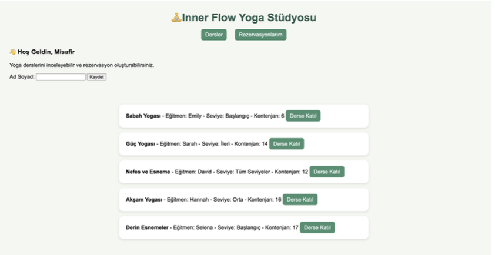
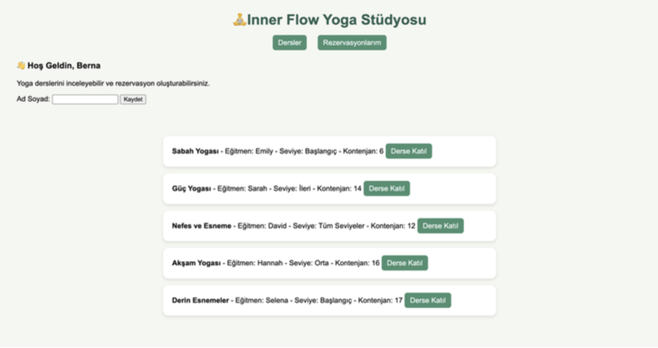
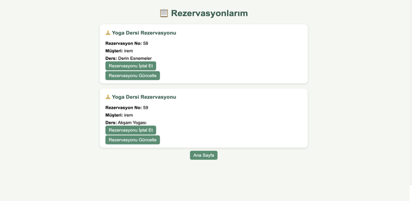
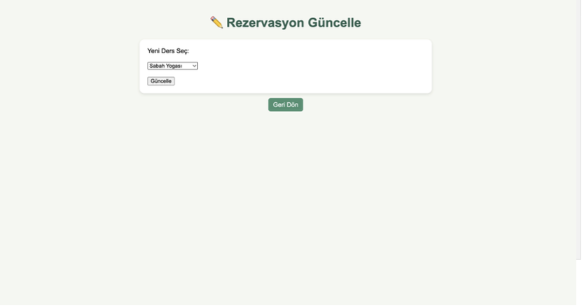

# 🧘 InnerFlow Booking

A Java-based yoga studio booking system built with Spring Boot, Thymeleaf, JPA, and PostgreSQL.

## 📖 About the Project

InnerFlow Booking is a web-based application developed to simplify yoga class reservations. The system allows users to browse available yoga sessions, create reservations, update existing bookings, and cancel reservations through an intuitive interface.

This project was developed as part of a university Java course to practice full-stack web application development using the Spring Boot framework.

---

## ✨ Features

- View available yoga sessions
- Create a reservation
- Update an existing reservation
- Cancel reservations
- Display reservation details
- User-friendly interface with Thymeleaf
- PostgreSQL database integration

---

## 🛠️ Technologies Used

- Java 21
- Spring Boot
- Spring MVC
- Spring Data JPA
- Thymeleaf
- PostgreSQL
- Maven
- HTML5
- CSS3

---

## 📂 Project Structure

```
src
├── controller
├── service
├── repository
├── model
├── templates
└── static
```

---

## 🚀 Getting Started

### Prerequisites

- Java 21
- Maven
- PostgreSQL

### Installation

1. Clone the repository

```bash
git clone https://github.com/YOUR_USERNAME/InnerFlowBooking.git
```

2. Open the project in IntelliJ IDEA.

3. Configure your PostgreSQL database.

4. Update the database credentials in:

```
application.properties
```

5. Run the project.

---

## 📸 Screenshots

### Home Page

Displays all available yoga sessions.



---

### Home Page (Logged-in User)

Shows the personalized welcome message after entering the user's name.



---

### Reservations

Users can view, update, and cancel their existing reservations.



---

### Update Reservation

Allows users to change the selected yoga session.



---

## 📌 Future Improvements

- User authentication
- Admin dashboard
- Email notifications
- Search and filtering
- Responsive design
- Online payment integration

---

## 👩‍💻 Developer

Developed by **İrem Pek** as a Java Spring Boot course project.
